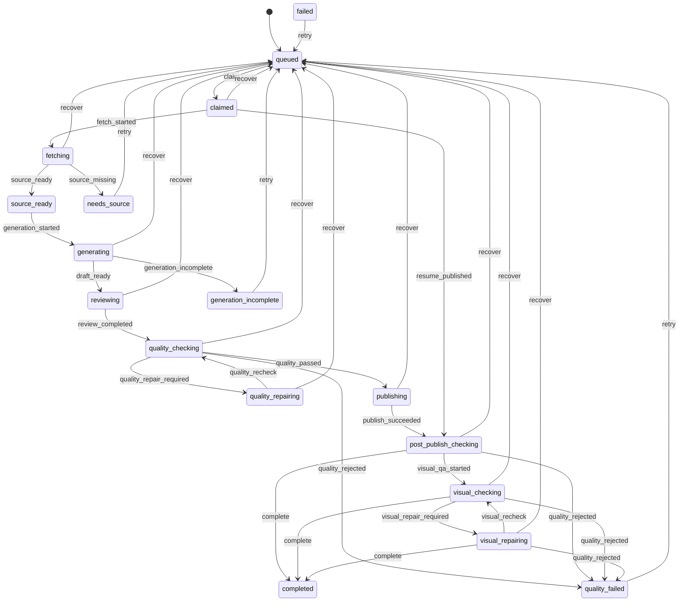

# MaxRead Workflow State Machine

MaxRead has two kinds of state:

- `workflow_state` is the durable business state used for recovery, retry, and terminal error classification.
- `stage` is a best-effort progress label used by the admin UI and Feishu reactions.

The old `queue_jobs.status` column remains as a compatibility projection:

- `queued`: waiting for a worker
- `running`: any non-terminal active workflow state
- `done`: `completed`
- `failed`: any retryable or terminal failure state

## Main lifecycle

`fail` is a controlled escape transition from any active state to `failed`.
`recover` is only for a worker that disappeared or stopped heartbeating. It
does not mark the paper as successful; the job starts again from `queued`.

Each running worker also owns a queue lease identified by `worker_id`. Heartbeat,
stage updates, workflow transitions, completion, and failure writes from the
queue worker validate that lease. A stale worker therefore cannot overwrite a
new worker after recovery. The recovery transaction rechecks `status = running`
under a write lock, so two workers cannot recover the same job.

## Why this split matters

The paper and article pipelines have different source and rendering handlers,
but their durable lifecycle is the same. They can therefore share queue
recovery, retry policy, progress reporting, and audit tooling without forcing
their parsing or publishing code into one large function.

Quality repair and visual QA are bounded subloops. A round can move from
`quality_checking` to `quality_repairing` and back, or from `visual_checking`
to `visual_repairing` and back. The configured round limit remains in those
controllers; the main state machine records where the loop is and why it
stopped.

Every durable transition increments `state_version` and appends a structured
`transition` record to `job_events`. Existing rows without `workflow_state`
are upgraded lazily from their old `status/stage` values.

`publish_succeeded` stores the Feishu document URL in `queue_jobs.doc_url` and
the expected title/formula/table counts in `checkpoint_json` before
post-publish checks. If the process dies after publishing, the next attempt
resumes from `post_publish_checking` and only verifies or repairs that document;
it does not fetch the paper or call the model again. Queue retries also keep
the normal idempotency boundary: a completed paper is reused rather than
creating a second document.

The queue has dedicated claim, heartbeat, and worker indexes. Enqueue uses an
immediate SQLite transaction so concurrent messages cannot both observe the
same dedupe key as inactive and create duplicate active jobs.

## Next refactor steps

The first three steps are now implemented: side effects remain in the existing
handlers, milestone events are persisted, quality/visual repair rounds are
represented as bounded state transitions, and published-document recovery is
idempotent. The remaining steps are:

1. Move terminal notification policy into a single queue finalizer.
2. Use the same transition log in the admin panel to show the exact blocked phase and retryability.
3. Add more resumable checkpoints for expensive phases, so a retry can skip a verified source fetch or document render.
